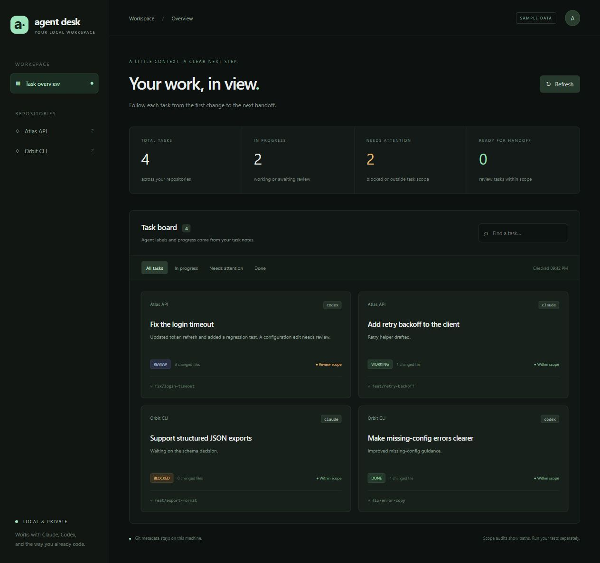
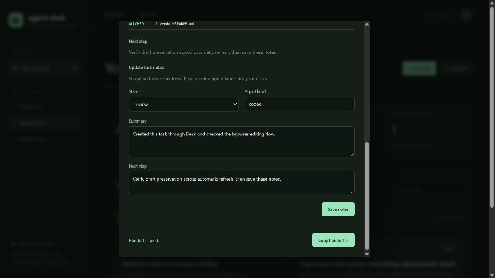

# Agent Desk

A local dashboard for your coding tasks: scopes, changed files, blockers, and the next handoff in one view.

Works with task files created by [Agent Lanes](https://github.com/hexmillionaire/agent-lanes). Claude Code and Codex can both use the same tasks. There are no model API calls, telemetry, accounts, or runtime dependencies. Each repository can be cloned and run independently.





## Install

Requires Node.js 24.8+ and Git. [Agent Desk 0.3.0 is released on GitHub](https://github.com/hexmillionaire/agent-desk/releases/tag/v0.3.0). npm publication awaits account approval; use the verified release archive below.

```sh
npm install -g https://github.com/hexmillionaire/agent-desk/releases/download/v0.3.0/hexmillionaire-agent-desk-0.3.0.tgz
agent-desk --repo /absolute/path/to/project
```

Open `http://127.0.0.1:4317`. Use `agent-desk --demo` to try the labeled sample tasks. The [connected quickstart](https://github.com/hexmillionaire/Agent-Lanes/blob/main/docs/QUICKSTART.md) walks through all three tools.

## Try it

Requires Node.js 24.8+ and Git.

```sh
git clone https://github.com/hexmillionaire/agent-desk.git
cd agent-desk
npm run demo
```

Open `http://127.0.0.1:4317`. Demo mode is labeled **SAMPLE DATA** and uses invented tasks. It reads no real repositories.

For your own work:

```sh
node bin/agent-desk.mjs --repo /absolute/path/to/project
node bin/agent-desk.mjs --repo /path/to/api --repo /path/to/cli --port 4317
```

Use quoted Windows paths on PowerShell. Choose **New task** to set a goal, task ID, and allowed/denied paths, or create tasks with Agent Lanes. Task cards show progress, agent labels, Git branch, changed-file counts, and scope warnings. Open a card to inspect paths, edit notes/status, and copy a fresh handoff. Task scope and the captured base remain fixed. Add `.agent-lanes/` to each repository's `.gitignore` before sharing changes.

The board refreshes every ten seconds while visible. Auto-refresh can be paused. Unsaved notes survive refresh; if another client changed the task, a save returns a conflict and asks you to reopen it. Start with `--read-only` to disable editing. Demo mode always stays read-only.

Agent labels and progress are manually recorded task metadata. Desk writes only `.agent-lanes/` task metadata in configured repositories. It does not inspect Claude/Codex app sessions, show live process status, launch agents, modify source code, verify tests, or infer completion. A `done` label is not a test result. Use separate worktrees for concurrent tasks; each task sees all changes since its base.

## Named repositories

Create an untracked `desk.config.json`:

```json
{
  "repositories": [
    { "name": "Atlas API", "path": "/absolute/path/to/api" },
    { "name": "Orbit CLI", "path": "/absolute/path/to/cli" }
  ]
}
```

Then run `node bin/agent-desk.mjs --config desk.config.json`. On Windows JSON paths must use `/` or escaped `\\`. Up to 20 trusted repositories can be configured. Errors remain visible instead of silently hiding failed audits.

## Local boundaries

The server binds only to `127.0.0.1`, rejects cross-origin requests and unexpected Host headers, exposes only configured repository IDs, and serves a fixed asset list. Writes require a same-origin request and a process-specific session token, are limited to task fields, and enforce a 16 KiB body limit. All data stays local until copied/shared. This is for a trusted single-user machine and trusted repositories. Same-user processes and browser extensions may access localhost; the token is browser CSRF protection, not isolation against them.

Copying a handoff requires clipboard permission in your browser. The report contains user-authored notes and file names, so review it before sharing.

## Development

Run `npm test`. The UI uses browser-native JavaScript and CSS with no build step. The engine is an unchanged MIT-licensed Agent Lanes 0.3.0 snapshot; [its source and hash](vendor/README.md) are recorded. Vendoring keeps archives and clones independent of npm availability. See the [connected quickstart](https://github.com/hexmillionaire/Agent-Lanes/blob/main/docs/QUICKSTART.md) and [demo](https://github.com/hexmillionaire/Agent-Lanes/blob/main/docs/DEMO.md).

Related: [Agent Lanes MCP](https://github.com/hexmillionaire/agent-lanes-mcp).

## Performance and reliability review

See the [October 2026 investigation](https://github.com/hexmillionaire/Agent-Lanes/blob/main/docs/INVESTIGATION.md) for measured results, language/runtime decisions, limitations, and the next improvements. Use the latest Node 24 LTS patch; Node 24.8 is the tested minimum.

Task creation requires a filesystem with hard-link support (such as NTFS, APFS, or ext4). Atomic file replacement prevents partial JSON reads; it does not merge simultaneous edits from separate processes.
